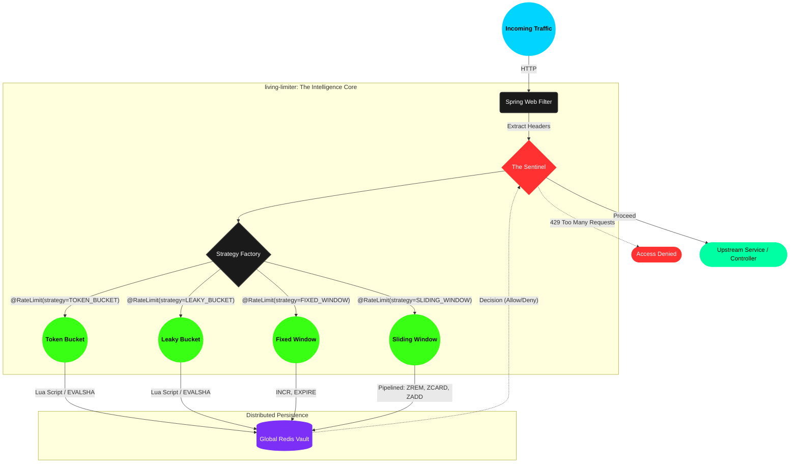

# Living Lab 🔬
> "I benchmarked 4 rate limiting algorithms so you don't have to."

Living Lab is my engineering organization dedicated to building ultra-high-performance, low-latency infrastructure components for modern distributed systems. I specialize in C++-core engines with native Python/Java/Go bindings.

## 🏛️ The Project: `living-limiter`
A 1,000,000+ req/s rate limiting engine using C++ atomics and my hybrid lease protocols.

### 📐 The Blueprint: High-Velocity Architecture

## 🧬 My Engineering Principles
1. **Performance First:** Everything I build is in C++/Java with a focus on lock-free concurrency.
2. **The Living Lab:** Every project includes a suite of benchmarks comparing at least 4 classic algorithms against my own innovations.
3. **Surgical Integration:** Native bindings for popular languages (Python, Java) to ensure zero-effort adoption for high-scale teams.
4. **Transparency:** Real-world metrics, p99 latency reports, and failure-mode analysis are built into every PRD I write.

## 🛠️ Tech Stack
- **Core:** C++20 / Atomics / Lock-free Data Structures
- **Bindings:** pybind11 (C++), JNI (Java)
- **Scale:** Target throughput of 1M+ transactions per second.
