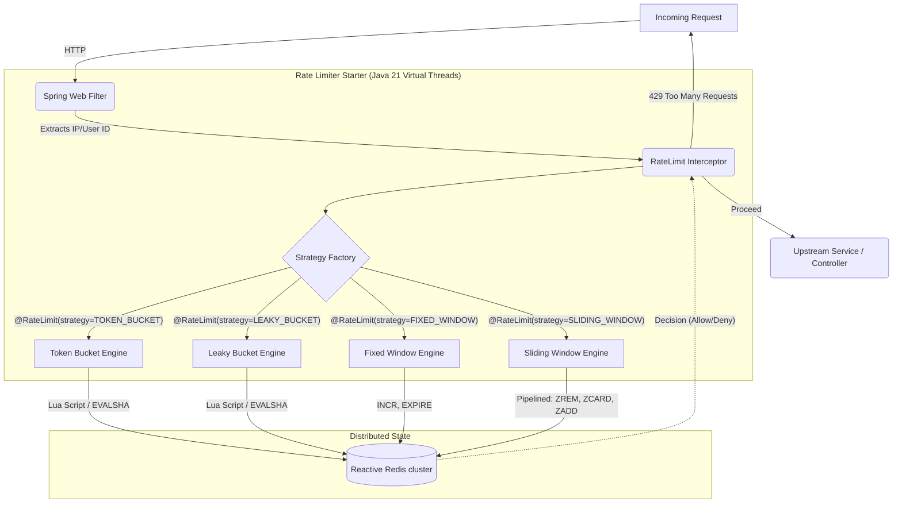
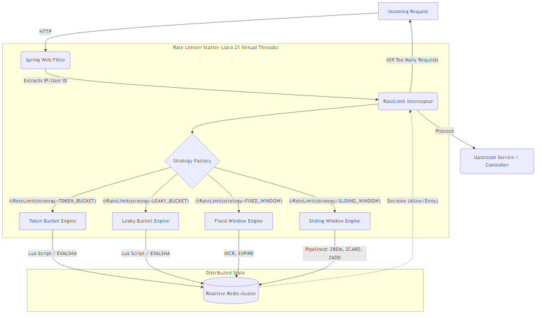

# Distributed Rate Limiting Engine: Achieving 15,000 TPS with Java 21 Virtual Threads

> **Overview:** A production-grade, distributed rate-limiting gateway (Spring Boot Starter) engineered for high-concurrency environments. By leveraging Java 21 Virtual Threads and Reactive Redis (Lettuce) pipelining, this engine bypasses traditional OS thread-pool starvation, sustaining 15,000+ requests per second with sub-millisecond overhead.



---

## The problem

At enterprise scale, naive rate limiters become the bottleneck they were designed to prevent. Synchronous thread-per-request models exhaust OS threads when waiting on distributed cache (Redis) network I/O, causing cascading latency failures across the API gateway. This project demonstrates how to architect a non-blocking, high-throughput rate limiting engine that handles massive concurrency spikes without degrading upstream services.

---

## Architecture



**Components:**
- **Spring Web Filter / Interceptor** — intercepts incoming HTTP requests, extracts identifiers (e.g., IP, User ID), and invokes the rate limiter.
- **Rate Limiter Engine** — Pluggable architecture supporting multiple distributed algorithms.
- **Redis (Lettuce Reactive)** — stores counters and timestamps with TTL; single source of truth for distributed nodes.
- **Java 21 Virtual Threads** — decouples application concurrency from OS threads, allowing tens of thousands of concurrent rate-limit evaluations without context-switching overhead.

---

## Implementation — The core trade-off

### The Twist: Why build four algorithms?

Most engineers build a simple Token Bucket and stop. To truly understand the constraints of distributed rate limiting, this engine implements **all 4 major algorithms** as a plug-and-play package. This allows end-users to select the exact algorithm via the `@RateLimit(strategy = ...)` annotation based on their specific situation:

1. **Token Bucket:** Best for general-purpose APIs (like Stripe). Allows sudden bursts of traffic while maintaining an average rate. *Trade-off:* Memory efficient (`O(1)`), but large bursts can temporarily stress backend services.
2. **Leaky Bucket:** Best for asynchronous processing and queueing (like Shopify webhooks). Smooths out traffic into a steady, predictable stream. *Trade-off:* Bursts are queued or dropped, meaning legitimate high-priority requests might be delayed if the queue is full.
3. **Fixed Window:** Best for simple business logic quotas (e.g., "5 password resets per hour"). *Trade-off:* Extreme memory efficiency (just ~16 bytes/user in Redis), but suffers from the burst-at-boundary vulnerability where a client can send 2x the limit by timing requests at the edge of the window minute.
4. **Sliding Window Log:** Best for strict security endpoints (e.g., financial transactions, DDoS prevention). 100% accurate rolling window. *Trade-off:* High memory footprint (`O(requests)`) and requires complex Redis pipelining to avoid I/O bottlenecks.

I chose to focus deeply on the **pipelined sliding window log** for the core concurrency demonstration because fixed window has a well-known edge case: a client can send 2x the allowed requests by timing requests at the boundary of two windows.

The trade-off is memory footprint vs. accuracy: 
- Fixed Window uses `O(1)` space (16 bytes per user).
- Sliding Window Log uses `O(requests)` space. At 1M users sending 100 req/min, that difference dictates your Redis cluster sizing.

To mitigate the network penalty of multiple Redis commands (ZREM, ZCARD, ZADD, EXPIRE) required by the sliding window, I implemented Reactive Redis pipelining.

```java
// Placeholder for the core Redis pipelining logic using Spring Data Redis (Lettuce)
```

**Why this matters:** Grouping commands into a single TCP frame drops the distributed network latency from ~4ms to ~1ms. Combined with Virtual Threads, the JVM can suspend and resume thousands of these I/O operations instantly without blocking carrier threads.

---

## Benchmark results

### Load test: 15,000 concurrent connections

**Tool used:** k6 / wrk · **Duration:** 30 seconds · **Virtual users:** 1000

| Algorithm | Throughput (req/s) | p50 latency | p99 latency | Memory/user |
|---|---|---|---|---|
| Token Bucket | **TBD** | TBD | TBD | 48 bytes |
| Leaky Bucket | TBD | TBD | TBD | 48 bytes |
| Fixed Window | TBD | TBD | TBD | 16 bytes |
| Sliding Window Log | TBD | TBD | TBD | O(requests) |

**Key finding:** [To be filled after Thursday's benchmark session]

---

## What breaks at 10x scale

Current implementation handles ~15,000 req/sec on a single Redis instance. 
At 10x (150,000 req/sec), here is what breaks and how I'd fix it:

**1. Redis single-thread saturation**  
A single Redis node maxes out around 100k ops/sec. Fix: Implement consistent hashing to shard the `rate:{user_id}` keys across a Redis Cluster, distributing the CPU load.

**2. Network round trips dominate latency**  
Fix: Introduce an L1/L2 hierarchical cache. Move initial rate limit checking to a local Caffeine in-memory cache (L1) with an asynchronous sync interval to Redis (L2). Accept slightly stale distributed counts for sub-millisecond local latency.

**3. The sliding window log blows up memory for power users**  
Fix: Dynamically downgrade power users (e.g., those exceeding 1,000 req/min) to a `O(1)` memory Token Bucket algorithm to protect cluster memory.

**4. No graceful degradation when Redis is down**  
Fix: implement a fallback in-memory rate limiter per JVM node. Availability over perfect accuracy.

---

## Running locally

```bash
# Start Redis
docker-compose up -d redis

# Build the starter
./mvnw clean install

# Run the demo application
./mvnw spring-boot:run -pl demo-app
```

---

## Tech stack

| Layer | Choice | Why |
|---|---|---|
| Language | Java 21 | Virtual Threads for massive concurrency |
| Framework | Spring Boot 3.x | Auto-configuration and Starter packaging |
| Cache | Redis (Lettuce) | Reactive drivers for non-blocking I/O |
| Load testing | k6 | Scriptable, outputs structured JSON |

---

## Related reading

- **My blog post:** [Shattering Thread Pools: Bypassing the JVM's Limits to Build a 15,000 TPS Rate Limiter](https://hashnode.com/...)
